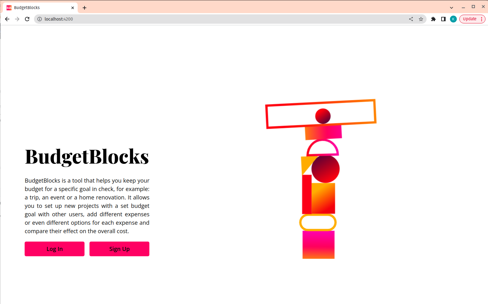
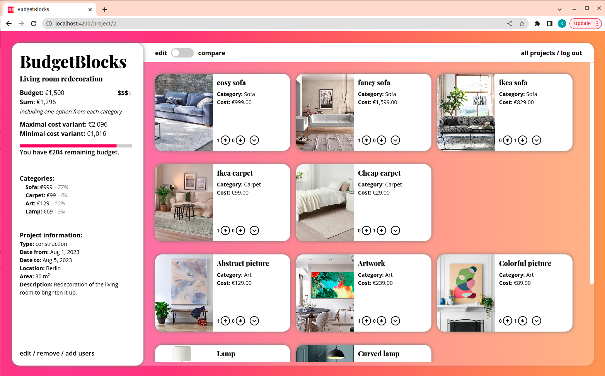
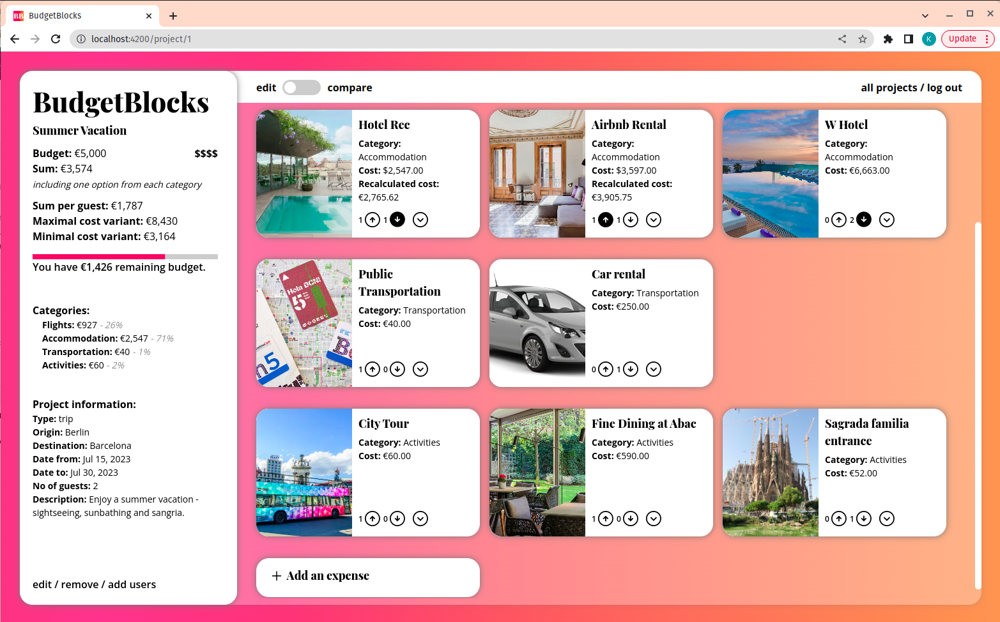
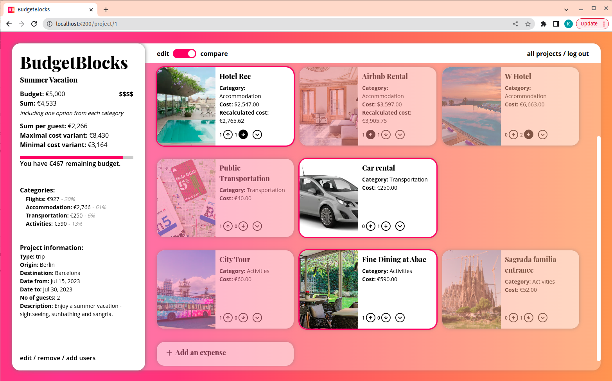

#  BudgetBlocks

BudgetBlocks is a tool that helps you keep your budget for a specific goal in check, for example: a trip, an event, or a home renovation. It allows you to set up new projects with a set budget goal with other users, add different expenses or even different options for each expense, and compare their effect on the overall cost.

## Screenshots

<p align="center">
  
  
  
  
</p>

## Preview video

Video of a project demo is uploaded [here](https://www.youtube.com/watch?v=tHvyqWPzkMI).

## Getting started

Make sure you have `git`, `node`, `npm` and `postgresql` installed. Then follow the instructions below:

1. Clone this repo and enter!

    ```bash
    git clone https://github.com/katarzynabogumil/BudgetBlocks.git
    cd BudgetBlocks
    ```
2. Set up environments on the client and server side.

    * Set up `.env` files in both `/client` and `/server` folders. You can use `.env.example` files for that. Fill out the port for the serverside, server and client urls.

    * Fill out your postgres user data in the serverside `.env` file.

    * Get an auth0 account and fill out the necessary data in both `.env` files - on the server and the client side.

    * Get an [exchange rates api key](https://exchangeratesapi.io/) and fill out the necessary flied in the serverside `.env` file.

    * Get an [openAI api key](https://platform.openai.com/account/api-keys) and fill out the necessary field in the serverside `.env` file.

3. Change to `server` folder, install dependencies and run server.

   ```bash
   cd server
   npm install
   npm run start-dev
   ```

4. Duplicate the terminal window, change to the `client` folder, install dependencies and run server.

   ```bash
   cd ..
   cd client
   npm install
   npm run start-dev
   ```

5. If you want to seed the database with the provided mockdata, sign up a user to the app and fill out their data in the serverside `.env` file. Then migrate database from `server/models` folder and start the server again.

   ```bash
   cd ..
   cd server
   npx prisma migrate dev --name init 
   npx prisma migrate reset
   npm run start-dev
   ```

* [Angular](https://github.com/angular)
* [Express](https://github.com/expressjs)
* [Prisma](https://github.com/prisma)
* [PostgreSQL](https://www.postgresql.org/)
* Testing:
  * [Jest](https://jestjs.io/)
  * [Cypress](https://www.cypress.io/)
  * [Jasmine](https://jasmine.github.io/)
* Other dependencies
  * [Typescript](https://www.typescriptlang.org/)
  * [Auth0](https://github.com/auth01)
  * [Dotenv](https://github.com/dotenv-org)
  * [Lottie Web](https://github.com/airbnb/lottie-web)


## Features

* Register and login using auth0.
* Projects:
  * Make a new project, choosing from the types: trip, event, construction and other.
  * Edit/ remove the project. When the currency of the project is changed, all expenses will be recalculated to match this currency using fresh Exchange Rates API data.
  * Invite other users to your projects.
  * Accept invitations to projects from other users.
  * After adding or editing data, receive a budget rating from OpenAI.
* Expenses:
  * Add expenses to the project. You can either choose from existing categories or make a new one.
  * Edit/ remove the expense. When the currency of the exchange is changed and does not match the project's currency, it will be recalculated using fresh Exchange Rates API data.
  * Add/ remove up-votes, down-votes, and comments to the expenses. 
  * After adding or editing expenses, you will receive information from OpenAI about which expense categories might still be missing.
  * Change order of expense categories.
* Compare data: switch to the compare mode to analyze the effect that different expense combinations have on the overall budget.
* You can also enjoy the app on your mobile phone.